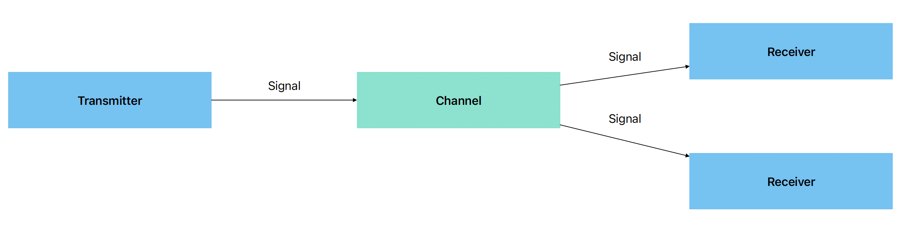

## What is it all about?

In simple words that is a message-driven non-blocking component-based framework powered by [Project Reactor](https://github.com/reactor) plus a little magic.

And we are going to talk about that magic, starting from a high-level idea and then drill down to the details.

As you might know, the Project Reactor is an implementation of [reactive-streams](https://www.reactive-streams.org) specification,
it is a powerful tool to build reactive non-blocking high-performance applications,
but to be successful with it you need to acquire pretty specific skills such as reactive style programming
which is quite different from the imperative style that most of the developers use.

While I still want to encourage you to learn more about reactive-style programming, you are probably just looking for
easy to go high-performance message-driven solution that can be easily expanded with new components and make it all in a fun way.

That is why that project exists.

## Radio transmission as a core idea

Imagine that you can think about your program interactions as a radio broadcast.


You have **Channels** and **Signals** that travel inside. And you have **Transmitters** to send **Signals** and **Receivers** to correspondingly receive them.


```java
    SignalTransmitter transmitter = new DefaultSignalTransmitter("hello-channel");
    
    SignalReceiver<String> receiver = new DefaultSignalReceiver<>(
            String.class,
            signal -> System.out.printf("Received Signal with ID: %s and message: %s%n", signal.getId(), signal.getMessage())
    );
    
    receiver.tune(transmitter.getChannel());
    
    transmitter.transmit(Signal.message("Hello World!"));
    transmitter.shutdown();
```

Each **Transmitter** creates its own **Channel** and sends **Signals** into it, one or more **Receivers** can be tuned to the specific **Channel** to receive **Signals**.


```java
    SignalTransmitter transmitter = new DefaultSignalTransmitter("hello-channel");

    SignalReceiver<String> firstReceiver = new DefaultSignalReceiver<>(
            String.class,
            signal -> System.out.printf("First Receiver: received Signal with ID: %s and message: %s%n", signal.getId(), signal.getMessage())
    );

    SignalReceiver<String> secondReceiver = new DefaultSignalReceiver<>(
            String.class,
            signal -> System.out.printf("Second Receiver: received Signal with ID: %s and message: %s%n", signal.getId(), signal.getMessage())
    );

    firstReceiver.tune(transmitter.getChannel());
    secondReceiver.tune(transmitter.getChannel());

    transmitter.transmit(Signal.message("Hello World!"));
    transmitter.shutdown();
```

But what is **Signal** itself?

Okay, that is a pretty simple data transfer object (DTO) that carries messages through **Channels**
and consists of **Id** and **Message**.

While a **Message** is a generic type payload **Id** is a unique Identifier that can help you trace signal through
the whole chain from **Transmitter** to **Receiver**

```java
    public final class Signal<T> {
    
        private final String id;
        private final T message;
        
    }

```

## One more thing

You can find this model not enough in terms of standard ETL process and you are right in most cases we need to transform
data in some way while it flows through our application.

For that purpose, there is one more core component **Transformer** that you can place between **Transmitter** and **Receiver(s)**


**Transformer** accepts **Signals** from a specific **Channel** transforms their messages and sends the result to a different **Channel**

```java
    SignalTransmitter transmitter = new DefaultSignalTransmitter("hello-channel");

    SignalTransformer<String> transformer = new DefaultSignalTransformer<>(
        String.class,
        "transformed-channel",
        String::toUpperCase
    );

    Channel transformedChannel = transformer.connect(transmitter.getChannel());

    SignalReceiver<String> firstReceiver = new DefaultSignalReceiver<>(
    String.class,
    signal -> System.out.printf("First Receiver: received Signal with ID: %s and message: %s%n", signal.getId(), signal.getMessage())
    );

    SignalReceiver<String> secondReceiver = new DefaultSignalReceiver<>(
    String.class,
    signal -> System.out.printf("Second Receiver: received Signal with ID: %s and message: %s%n", signal.getId(), signal.getMessage())
    );

    firstReceiver.tune(transformedChannel);
    secondReceiver.tune(transmitter.getChannel());

    transmitter.transmit(Signal.message("Hello World!"));
    transmitter.shutdown();
```

## Summarizing core

So as a core of this framework, we have the next entities and components:
- **Signal**: traceable DTO that carries message payload through **Channels**.
- **Channel**: transport for **Signals** created by **Transmitter** or **Transformer**. Each **Channel** has its own name.
- **SignalTransmitter**: creates **Channel** with a specific name and transmits **Signals** through this **Channel**.
- **SignalReceiver**: receives **Signals** from a specific **Channel** it is tuned.
- **SignalTransformer**: receives **Signals** from a specific **Channel** transforms it and sends it to another **Channel**